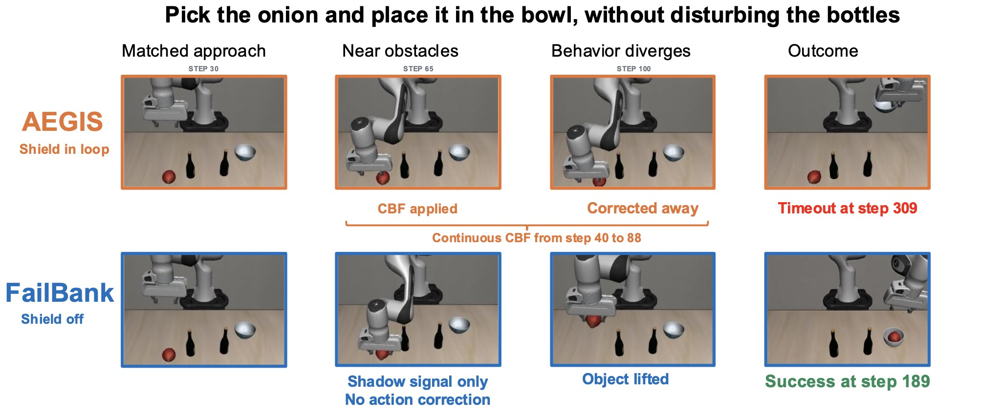
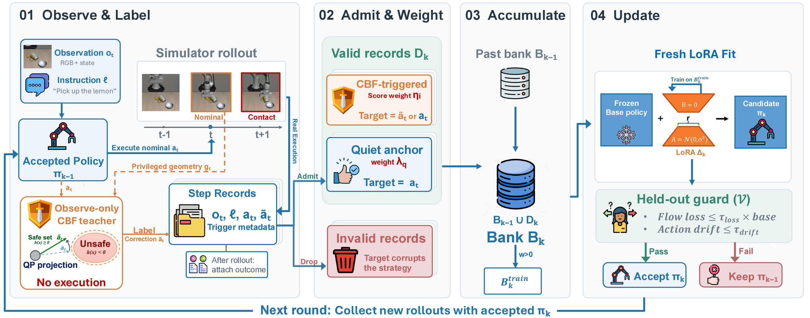
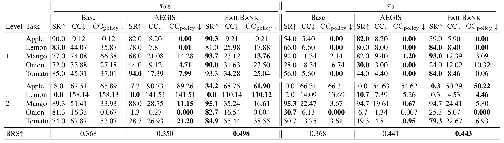
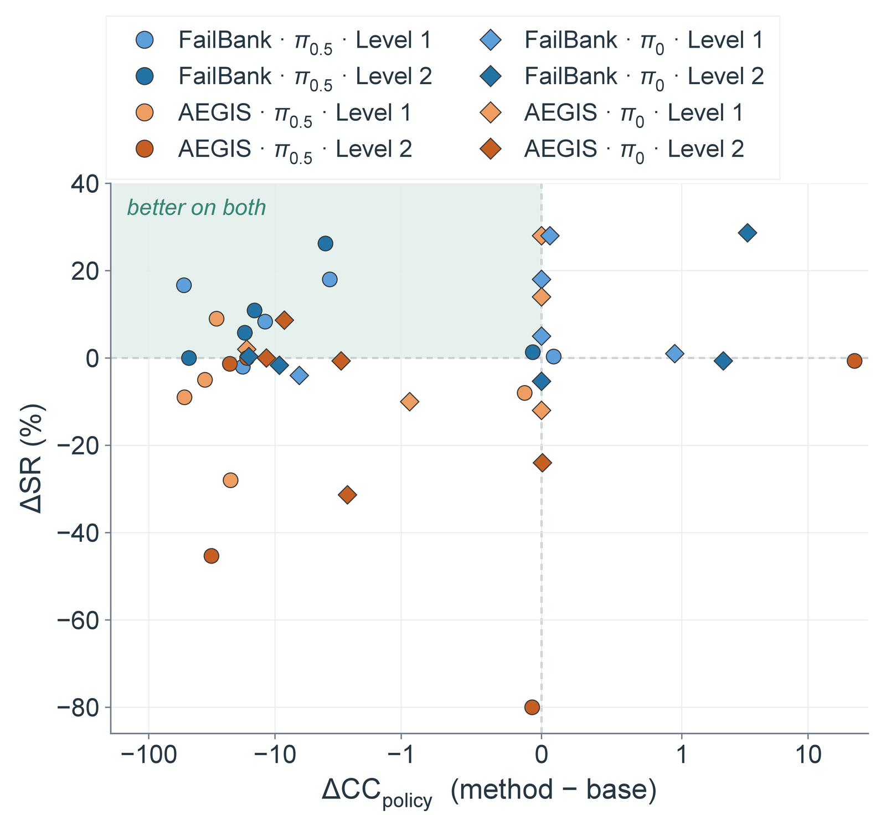
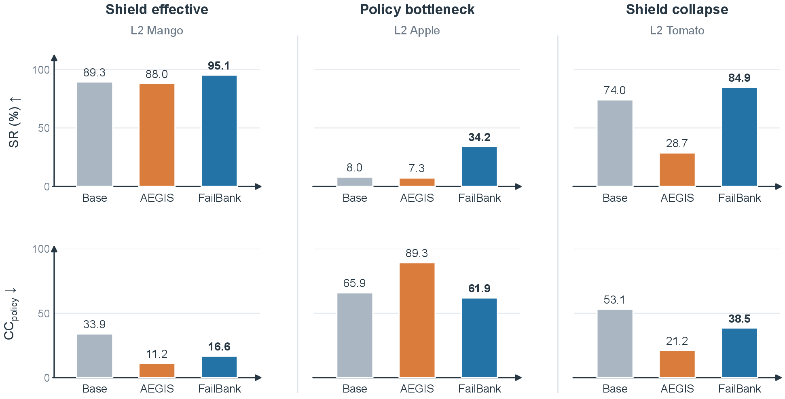
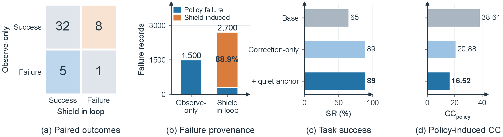
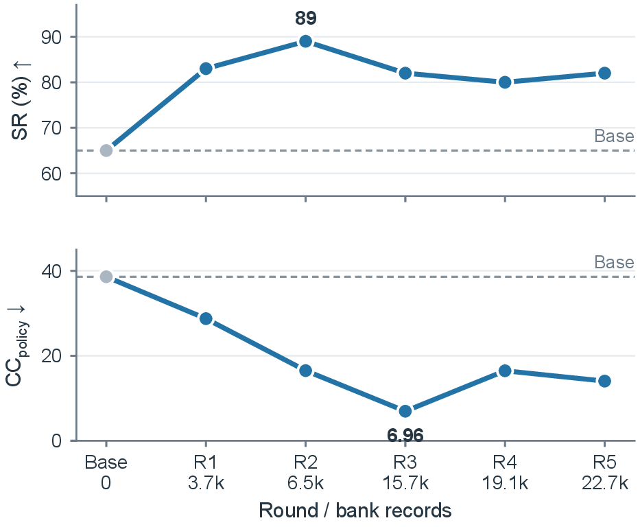

<h1 align="center">FailBank: Learning from Runtime Feedback through<br>Failure-Bank Self-Evolution for Vision-Language-Action Models</h1>

<p align="center">
  <a href="https://github.com/Mingyuee88">Mingyue Cui</a><sup>*</sup> ·
  <a href="https://franciscoliu.github.io/">Zheyuan Liu</a><sup>*</sup> ·
  <a href="https://yihan226.github.io/">Yihan Zhu</a> ·
  <a href="https://jasonzhangzy1757.github.io/">Zheyuan Zhang</a> ·
  <a href="http://www.meng-jiang.com/">Meng Jiang</a><sup>†</sup><br>
  University of Notre Dame<br>
  <sub><sup>*</sup>Equal contribution &nbsp;&nbsp; <sup>†</sup>Corresponding author (mjiang2@nd.edu)</sub>
</p>

<p align="center">
  <!-- TODO: replace XXXX.XXXXX with the arXiv id -->
  <a href="https://arxiv.org/abs/XXXX.XXXXX"></a>
  <a href="https://mingyuee88.github.io/FailBank/"></a>
  <a href="LICENSE"></a>
  
</p>

<p align="center">
  
</p>

## 📢 Updates

- **[Sep 2026]** Code, VLA-Arena patch and project page released.

## 📖 Overview

**FailBank** turns runtime shield feedback into persistent policy improvement. An **observe-only** CBF teacher labels the policy's actions without executing them; outcome-aware admission turns the labels into learning records that accumulate in a **failure bank**; a **guarded LoRA update** produces the next policy.

<p align="center">
  
</p>

## 📊 Results

VLA-Arena static-obstacle suite, Levels 1–2, Arena-finetuned π<sub>0.5</sub> and π<sub>0</sub>. Update data comes only from Level 1 Mango.

<p align="center">
  
</p>

<p align="center">
  
</p>

<p align="center">
  
</p>

<details>
<summary><b>Ablations and self-evolution rounds</b></summary>
<p align="center">
  <br>
  
</p>
</details>

## 📂 Installation

```bash
# VLA-Arena at the verified commit + the FailBank patch
git clone https://github.com/PKU-Alignment/VLA-Arena.git && cd VLA-Arena
git checkout 2ddcb00 && git apply ../FailBank/patches/vla-arena-2ddcb00.patch
# inside VLA-Arena's OpenPI environment (envs/openpi, Python 3.11)
pip install -e ../FailBank                 # core
pip install -e "../FailBank[aegis]"        # optional: AEGIS baseline
export PYTHONPATH=$PWD:$PYTHONPATH
export FAILBANK_CHECKPOINTS=/path/to/checkpoints
```

Checkpoints: [`VLA-Arena/pi05-vla-arena-finetuned`](https://huggingface.co/VLA-Arena/pi05-vla-arena-finetuned) → `pi05_vla_arena_finetuned/`, [`VLA-Arena/pi0-vla-arena-fintuned`](https://huggingface.co/VLA-Arena/pi0-vla-arena-fintuned) → `pi0_vla_arena_finetuned/`.

## 🚀 Quick Start

One GPU, about an hour: collect → build bank → guarded update → evaluate.

```bash
bash examples/minimal/run_minimal.sh
```

## 🛠️ Running FailBank

```bash
# Stage 1  observe-only collection (one cell per offset)
failbank-rollout --output runs/r1/off0/result.json --task-level 1 --task-id 2 --offset 0 --record-root runs/r1/records

# Stage 2-3  derive, accumulate, gate
failbank-build-derived --records-root runs/r1/records --folds 0
failbank-merge-bank    --round r1=runs/r1/records --round r2=runs/r2/records --out runs/bank
failbank-build-round   --src-root runs/bank --dst-root runs/bank_s1s2 --mode s1s2

# Stage 4  guarded LoRA update, fold
failbank-train --records runs/bank_s1s2 --base-checkpoint $FAILBANK_CHECKPOINTS/pi05_vla_arena_finetuned \
               --output-root runs/adapter --steps 800 --batch-size 32 --data-seed 1
JAX_PLATFORMS=cpu failbank-fold --adapter runs/adapter/offset_0 \
               --base $FAILBANK_CHECKPOINTS/pi05_vla_arena_finetuned --output runs/ckpt

# Evaluate
failbank-rollout --output runs/eval/off0/result.json --task-level 1 --task-id 2 --offset 0 --policy-checkpoint runs/ckpt
```

Use `--openpi-config pi0` for π<sub>0</sub>, and `--teacher your_pkg.module:YourShield` to plug in another observe-only shield.

## 🗂️ Repository

```
src/failbank/     teacher/ records/ pipeline/ train/ runtime/
patches/          VLA-Arena patch (evaluator step seam)
extras/           AEGIS baseline (optional)
examples/minimal  end-to-end example
experiments/      original cluster launchers
docs/             project page
```

More details (reproduction, data field notes): [NOTES.md](NOTES.md) · [VERIFICATION.md](VERIFICATION.md)

## Citation

```bibtex
@article{cui2026failbank,
  title   = {Learning from Runtime Feedback through Failure-Bank Self-Evolution for Vision-Language-Action Models},
  author  = {Cui, Mingyue and Liu, Zheyuan and Zhu, Yihan and Zhang, Zheyuan and Jiang, Meng},
  journal = {arXiv preprint},
  year    = {2026}
}
```

## Acknowledgment

This project builds upon [VLA-Arena](https://github.com/PKU-Alignment/VLA-Arena), [openpi](https://github.com/Physical-Intelligence/openpi) and [vlsa-aegis](https://github.com/THU-RCSCT/vlsa-aegis). Licensed under Apache-2.0; see [THIRD_PARTY_NOTICES.md](THIRD_PARTY_NOTICES.md).
